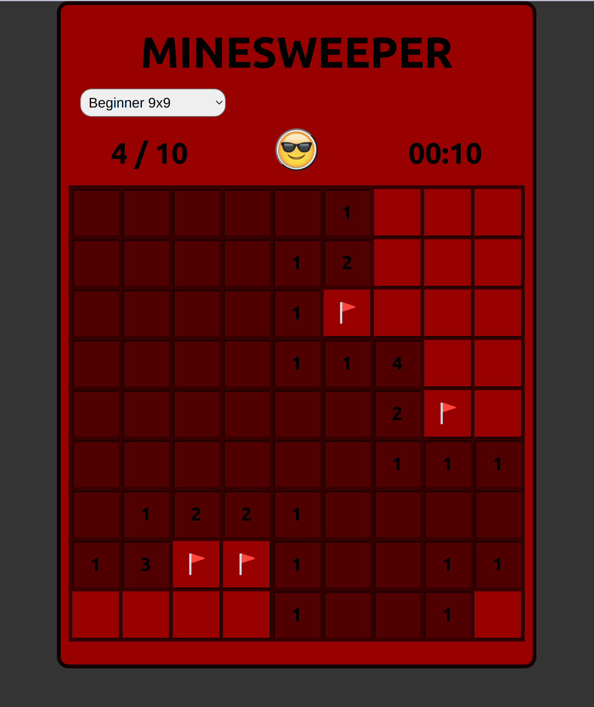

# Minesweeper

## Created with Javascript, React, and CSS.

## <a href ='https://lisa-fink.github.io/minesweeper/'> Live Preview </a>

### Left clicks select each open tile pressed

### Right clicks add or remove flags

### Numbered tiles display the number of adjacent mines

 

### Has 3 levels:

Beginner 9x9 grid with 10 mines 
Intermediate 16x16 grid with 40 mines 
Expert 30x16 grid with 99 mines 
 

### Includes all of the features of the original game:

Tracks how many flags placed 
Smiley Emoji as a reset game button  
A timer that runs from the first tile selected to the end of the game 
